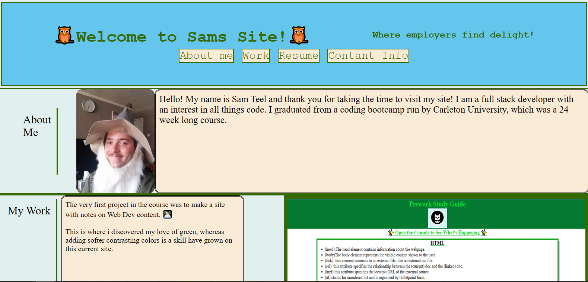

# Portfolio

[Link to the site](https://teelsam.github.io/SimplePortfolio/)

Welcome to the README!

Starting out as my orignial portfolio created during my FullStack course, I have made modifications to it overtime to make it more sleek. The site contains a basic bio, my previous projects links to live sites and github code repositories. As well as contact info for reaching my email! 

## Table of Contents

An index.html file holding the bones of the project.
Along with a new type of CSS file- the reset.css file which undoes any browser given designs.
And the Style.css which houses our delectable designs and colors.

Also the ever important README file which you are now reading.

## Site ScreenShot

.

## Emoji source

All emojis were sourced from [github-emojis](https://emojis.github.io/).
